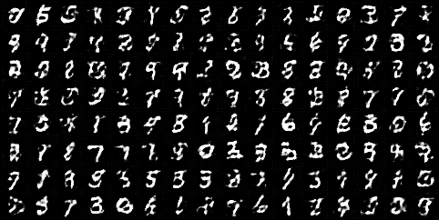
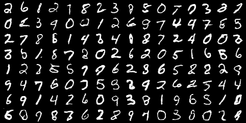
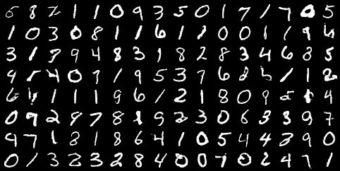

# Least Squares Generative Adversarial Networks

## Description

SUMMARY: 
> Unsupervised learning with generative adversarial networks (GANs) has proven hugely successful. Regular GANs hypothesize the discriminator as a classifier with the sigmoid cross entropy loss function. However, we found that this loss function may lead to the vanishing gradients problem during the learning process. To overcome such a problem, we propose in this paper the Least Squares Generative Adversarial Networks (LSGANs) which adopt the least squares loss function for the discriminator. We show that minimizing the objective function of LSGAN yields minimizing the Pearson divergence. There are two benefits of LSGANs over regular GANs. First, LSGANs are able to generate higher quality images than regular GANs. Second, LSGANs perform more stable during the learning process. We evaluate LSGANs on five scene datasets and the experimental results show that the images generated by LSGANs are of better quality than the ones generated by regular GANs. We also conduct two comparison experiments between LSGANs and regular GANs to illustrate the stability of LSGANs.

- this repository is the implementation of [Least Squares Generative Adversarial Networks](https://arxiv.org/pdf/1611.04076.pdf)

- test with using MNIST dataset.

- learning process is almost same as Reguler GAN such as DCGAN, but LSGAN uses Least Squares in criterion.

- In the Paper, the recommended values of a, b, c = -1, 1, 0 or 0, 1, 1

## result

- Generated images after trained LSGANs model 30 epochs

epoch 1

epoch 15

epoch 30

