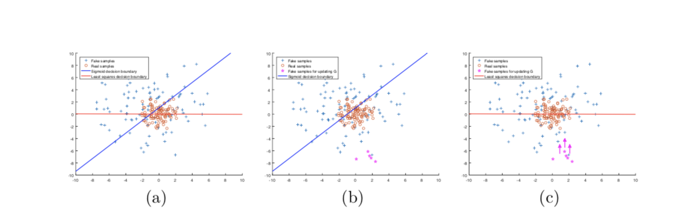
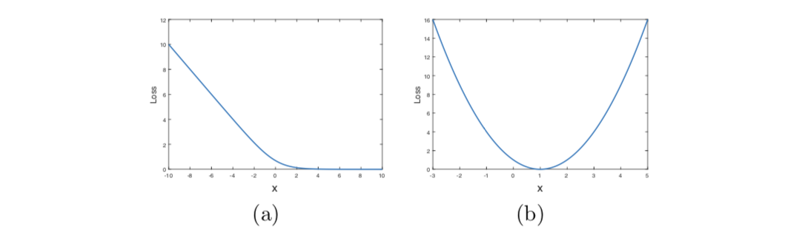
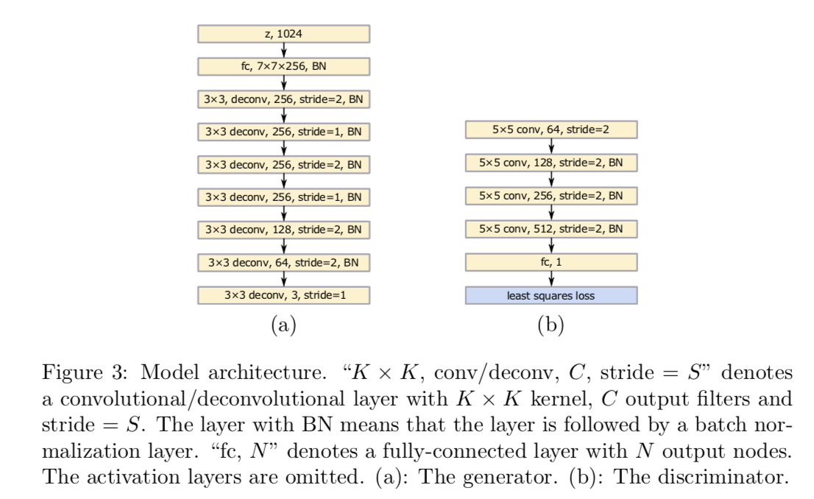

# Least Squares Generative Adversarial Networks

- [Arxiv](https://arxiv.org/pdf/1611.04076.pdf)
- GANに関する論文
- 論文実装の前に一旦概要をまとめておく

## 概要

- Least Squares GANは正解ラベルに対する二乗誤差を用いる学習手法の提案

## Abstract

- GANには通常誤差関数としてシグモイドクロスエントロピー誤差が用いられるが，学習過程で勾配消失が起こりうる．
- それを解決すべく，最小二乗を用いたGANの提案を行う．
- LSGANの目的関数を最小化すると、ピアソンのχ2発散が最小化されることを示す．
- LSGANが正規化GANよりも優れている点は
	- 生成される画像のクオリティが高い
	- 学習過程で安定したパフォーマンスを得られる

## Introduction

- GANはend-to-endで学習することができる．
- GANの基本的なアイデアは，分類器と生成器を同時に学習させる: 生成器がfake sampleを生成している間，分類器はreal sampleとgenerated sampleの判別をする; 生成器は分類器に本物のデータとフェイクデータの判別が難しくなるように生成する

- 上図のb)がsigmoid cross entropy誤差，c)が最小二乗誤差．最小二乗誤差では生成されるデータをリアルに近づけることができる．

## Method

### Generative Adversarial Networks

- GANの学習プロセスは判別器$D$と生成器$G$の同時学習．
- $G$は $p_g | x$を学ぶ

$ \min_G \max_D V_{GAN} (D, G) = E[\log D(x)] + E[\log (1 - D(G(z)))] $

### Least Squares Generative Adversarial Networks

- $a$，$b$，$c$を用いてLSGANの目的関数は以下のようになる

$ min_D V_{LSGAN}(D) = \frac{1}{2} E[(D(x) - b)^2] + \frac{1}{2} E[(D(G(z)) - a)^2]$

$ min_G V_{LSGAN}(G) = \frac{1}{2} E[(D(G(z)) - c)^2]$

- ここで，$a$と$b$はfake dataとreal dataのラベルで，$c$は生成器$G$が分類器$D$にfake dataと信じてほしい値を表している．

#### Benefits of LSGANs

- まず，正規化GANとは違って，決定境界の正しい側に分類されているfake dataに対しても罰金を科す．よって決定境界に向かって生成器はサンプルを生成することになる．
- また，勾配消失の問題も解決する．

#### Parameters Selection

- $a, b, c = -1, 1, 0 \| 0, 1, 1$が推奨．

### Model Architecture

